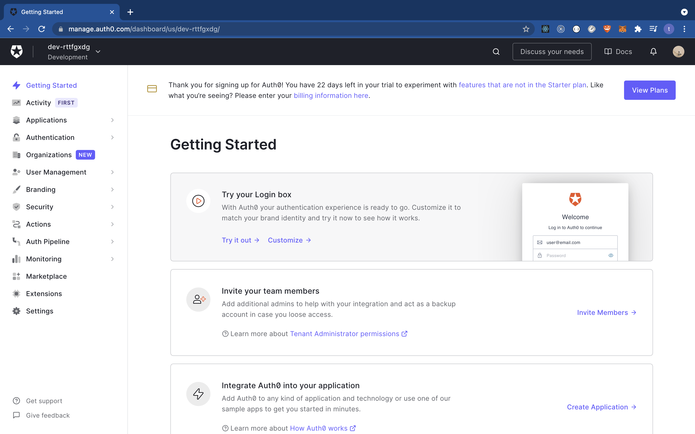
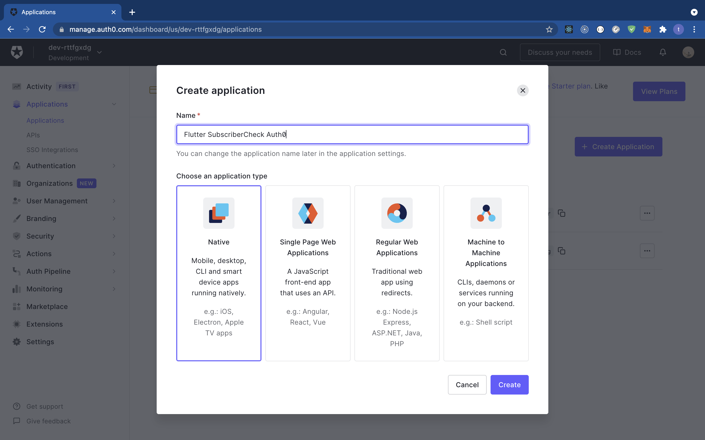
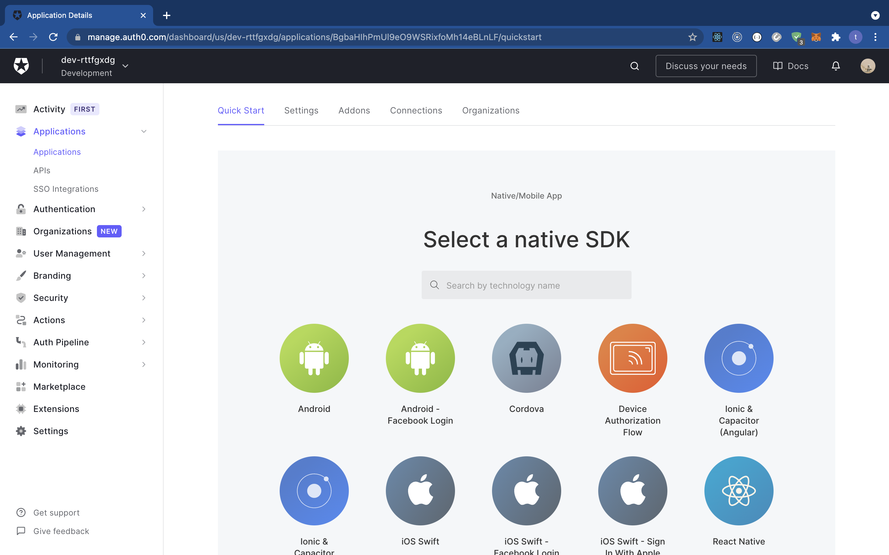
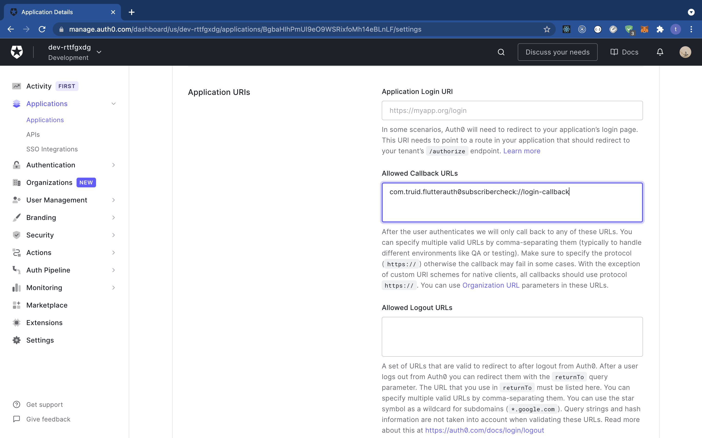

# SIM Card Based Authentication with Flutter, Auth0 and tru.ID SubscriberCheck

## Requirements

- A [tru.ID Account](https://tru.id)
- An [Auth0 Account](https://manage.auth0.com)
- [Ngrok](https://ngrok.com)
- A mobile phone with a SIM card and mobile data connection

## Getting Started

Clone the starter-files branch via:

```bash
git clone -b starter-files --single-branch https://github.com/tru-ID/sim-based-authentication-flutter-auth0.git
```

If you're only interested in the finished code in main then run:

```bash
git clone -b main https://github.com/tru-ID/sim-based-authentication-flutter-auth0.git
```

Create a [tru.ID Account](https://tru.id)

Install the tru.ID CLI via:

```bash
npm i -g @tru_id/cli

```

Input your **tru.ID** credentials which can be found within the tru.ID [console](https://developer.tru.id/console)

Install the **tru.ID** CLI [development server plugin](https://github.com/tru-ID/cli-plugin-dev-server)

Create a new **tru.ID** project within the root directory via:

```
tru projects:create flutter-auth0 --project-dir .
```

Run the development server, pointing it to the directory containing the newly created project configuration. This will run a local development server on port `8080`

```
tru server
```

To make the development server publicly accessible on the internet, run the following in a new terminal:

```bash
ngrok http 8080
```

## Setting up Auth0

Head over to the Auth0 and [sign in](https://manage.auth0.com). When signed in you'll be redirected to the dashboard as shown below.



To create a new application by clicking on the "applications" pane on the left hand side. This will route you to a new page. Click on the "create application" button to create a new application as shown below.



This will give you `Client ID` and `Client Secret` values which can be found under the settings tab.



Next, we need to set up the application callback URL. In the settings page scroll to "Application URIs" and in the "Application callback URL" section enter the following:

```
com.truid.flutterauth0subscribercheck://login-callback
```

As shown below:



Next, we need to copy our the values of the `.env.example` to `.env`:

```bash
cp .env.example .env
```

Replace `AUTH0_CLIENT_ID` with the `Client ID` value.

Next, replace `AUTH0_DOMAIN` with the `Domain` value.

Update `AUTH0_ISSUER` with the appropriate value.

## Run the app

To start the project, ensure you have a physical device connected then run:

```bash
flutter run
```

> **Note** For a physical iOS device ensure you've [provisioned your project in XCode](https://flutter.dev/docs/get-started/install/macos#deploy-to-ios-devices)
